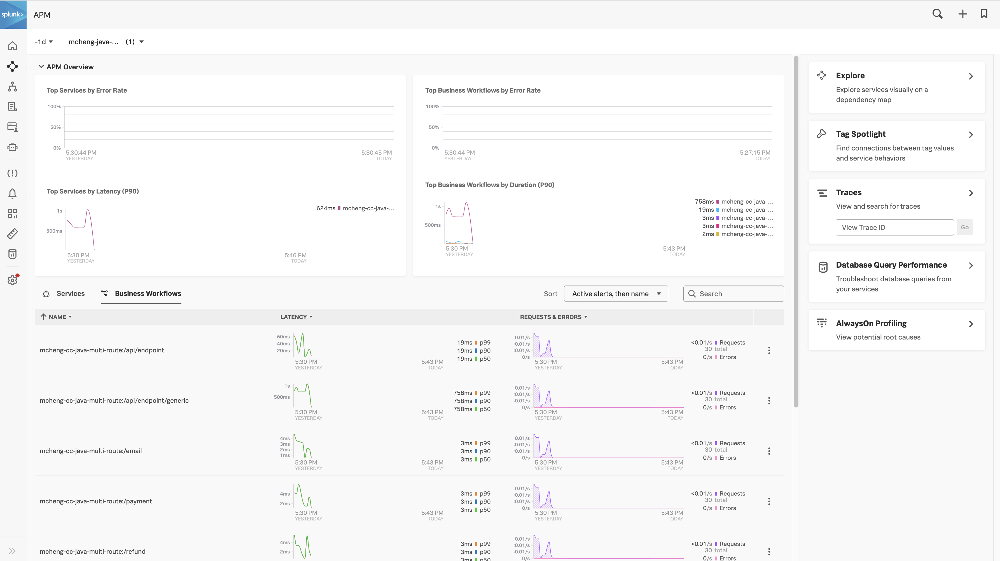
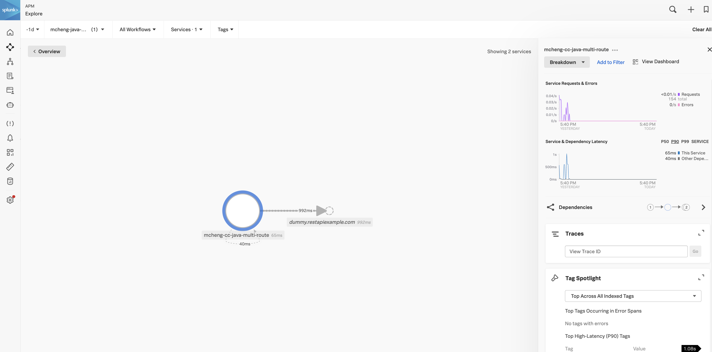

# Multi Route Spring Project 

This project is used to demonstrate how we can quickly get traces into the Splunk Observability Platform. 

---

## Components
The project contains the following components / scripts to get traces sent to the Splunk Observability Platform.

- Splunk Otel Java Agent (v0.51)
    - splunk-otel-javaagent.jar
- Docker-compose
    - Runs the OTEL agent
    - Uses the otel-collector-config.yaml configuration
- Script to start the application
    - start.sh
- Script to constantly generate traffic
    - curl5mins.sh

---
# How to run

## Prerequisites
* Java 1.8
* Docker


## 1 - Start OTEL agent
```shell script
./docker-compose up
```

## 2 - Build Application
```shell script
mvn package
```

## 3 - Create Configuration File
Create a `.env` file with the necessary configuration
```properties
SPLUNK_ACCESS_TOKEN=<<token>>
SPLUNK_REALM=<<realm>>
OTEL_EXPORTER_OTLP_ENDPOINT=http://splunk-otel-collector:4317
SPLUNK_PROFILER_ENABLED=false
SPLUNK_HEC_URL=<<hec_url>>
SPLUNK_HEC_TOKEN=<<hec_token>>
```

## 4 - Start Application
```shell script
./start.sh
```

## 5 - Start Testing Script
```shell script
./curl5mins.sh
```

--- 
# Splunk Observability Platform




